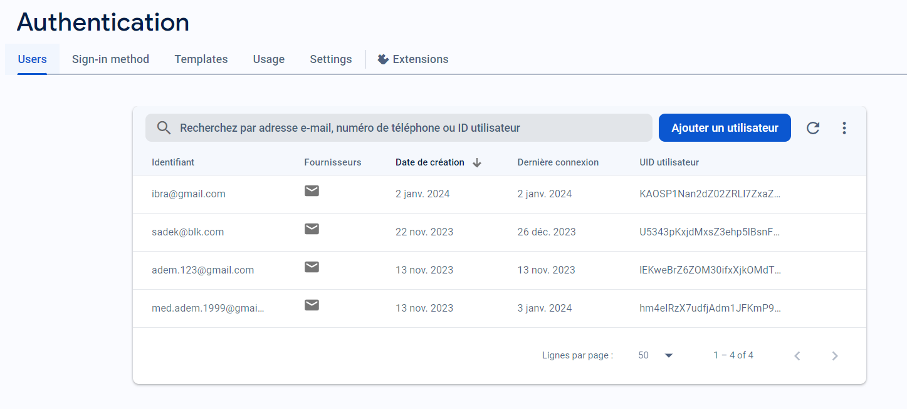
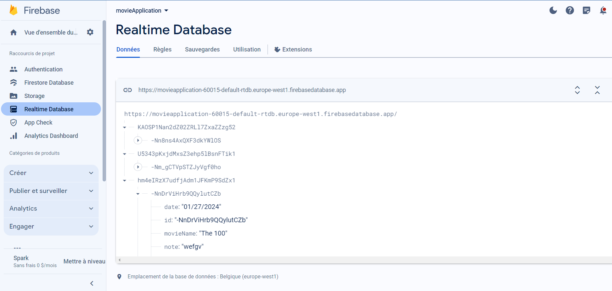

# Movie Memo App

## Overview

Welcome to Movie Memo App, an Android application developed in Java that enhances your movie-watching experience. This app allows users to explore a diverse collection of movies, add personal notes, and schedule dates for watching. The integration of Firebase ensures secure authentication and real-time database synchronization, while a third-party API fetches comprehensive movie data. The user interface is designed using RecyclerView, Adapters, and dialogues, providing a seamless and personalized experience.

## Features

### User Authentication

- **Firebase Authentication:** Users can sign up or log in securely using Firebase authentication.
- **Personalized Experience:** Secure authentication ensures a personalized and user-specific experience.

### Movie Database Integration

- **API Fetching:** The app fetches movie data from a third-party API, offering a wide range of movies.
- https://api.tvmaze.com/shows
- **RecyclerView and Adapter:** Utilizes RecyclerView and Adapter for an organized and dynamic display of movie information.

### Movie Notes

- **Personalized Notes:** Users can add personal notes to each movie, capturing thoughts, recommendations, or any relevant information.
- **Real-time Synchronization:** Notes are stored in Firebase Realtime Database, ensuring seamless synchronization across devices.

### Watch Date Scheduler

- **Scheduling Feature:** Users can schedule dates to watch specific movies.
- **User-Friendly Interface:** Provides a calendar or date picker for easy date selection.

### Firebase Realtime Database

- **Data Storage:** Firebase Realtime Database is employed to store and retrieve user-specific movie notes.
- **Real-time Updates:** Ensures the latest information is always available.

## Tech Stack

- **Android Studio:** The official IDE for Android app development.
- **Java:** Primary programming language for Android app development.
- **Firebase Authentication:** Ensures secure user authentication.
- **Firebase Realtime Database:** Stores and retrieves user-specific movie notes.
- **Third-party Movie API:** Fetches detailed information about movies.
- **RecyclerView and Adapter:** Organized display of movie information.
- **Calendar/Date Picker:** Facilitates easy date selection for scheduling.

## Setup

### Firebase Configuration

1. Create a Firebase project and set up Firebase Authentication.
2. Configure Firebase Realtime Database rules for secure data access.
   

### API Key

1. Obtain an API key from the chosen movie database API provider.
2. Add the API key to the app for fetching movie data.

### Project Configuration

1. Clone the repository to your local machine.
2. Open the project in Android Studio.
3. Set up Firebase credentials and API key in the project.

## Usage

1. Launch the app on an Android device or emulator.
2. Sign up or log in using Firebase authentication.
3. Explore the movie collection using the integrated API.
4. Save personal notes and schedule dates for movies.
5. Enjoy the seamless experience of real-time data synchronization.

## Demo Video

Check out the [Demo Video](img/MymovieApp.mp4) to get a visual walkthrough of the Movie Memo App in action.

## Screenshots

## Contributing

Contributions are welcome! Fork the repository, create a branch, make your changes, and submit a pull request.

## License

This project is licensed under the MIT License.

## Contact

For inquiries or support, contact [your email address].

---
